## Tools 
### Remix [:link:](https://remix-project.org/)
The Remix Project is a rich toolset which can be used for the entire journey of contract development by users of any knowledge level, and as a learning lab for teaching and experimenting with Ethereum (or EVM compatible chains).

### Metamask [:link:](https://metamask.io)
MetaMask is a software cryptocurrency wallet used to interact with the Ethereum blockchain. It allows users to access their Ethereum wallet through a browser extension or mobile app, which can then be used to interact with decentralized applications

## Setting up your wallet

### Setup
Install metamask extension on your browser. Metamask is available for Chrome and Firefox. You will need to follow a series of steps in order to create your store, set a password, and so on. 
Once you are ready, you will see the following screen. 

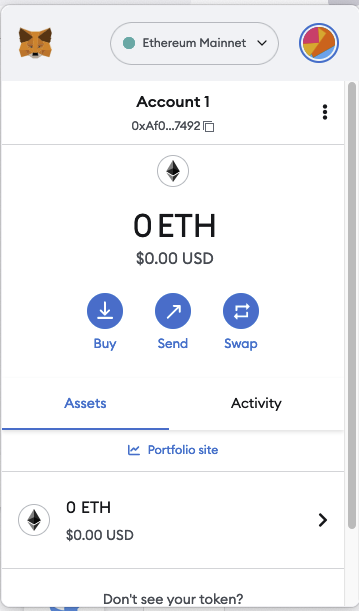

### Adding new network
In order to interact with the wallaby network, you will need to add it to the list of them. Please, click on the dropdown box where "Ethereum Mainnet" is displayed, and hit "Add network".

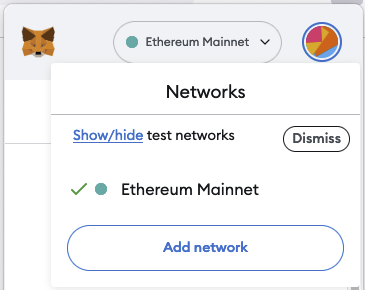

### Adding network manually
After a few seconds, you will end up on the following page. Please, click on "Add a network manually"

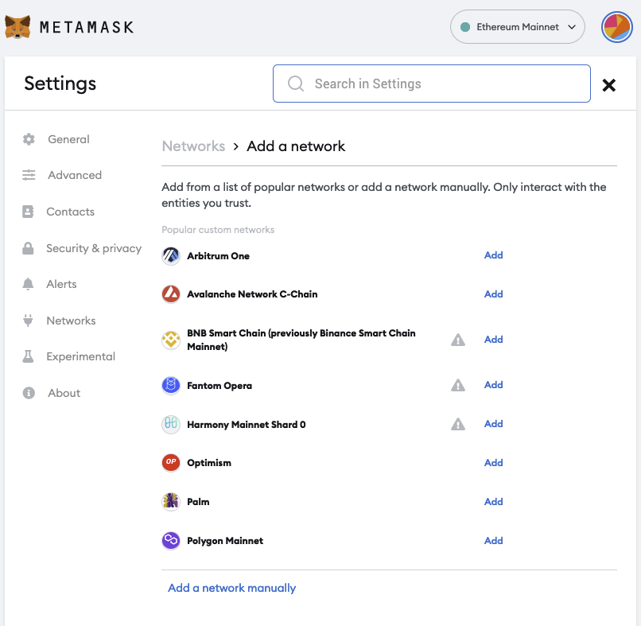

### Setting up the parameters
Now it is time to fill each text box with the corresponding value. Once you finish typing in the values, hit "Save".

- Name: Filecoin Wallaby
- RPC URL: https://api.zondax.ch/fil/node/wallaby/rpc/v0
- ChainID: 31415 (Wallaby's ID)
- Currency symbol: TFIL (Test FIL).

### Choosing Wallaby network
Click again on the network selector, and choose the new "Filecoin Wallaby" network.

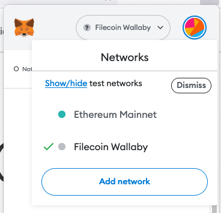

### Your address
Now that you have chosen the wallaby network, your address is ready to use. But you need some tokens in order to spend gas on smart contracts. Copy the address, as you will need it in the next step.

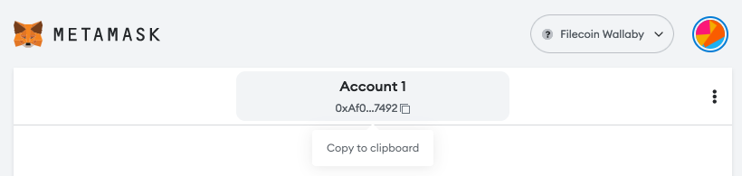

### Time to get some tokens 
Go to the [faucet website :link:](https://wallaby.network/#faucet), paste the address you copied on the previous step, complete the captcha challenge, and ask for the tokens. Some minutes will pass until the transactions is finished.

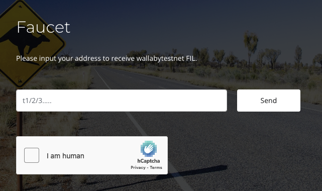

### Ready to go! 
Some minutes after requesting tokens on the faucet, you will be your new balance reflected on your wallet. Congratulations! You are ready to deploy your smart contracts using Remix and Metamask.

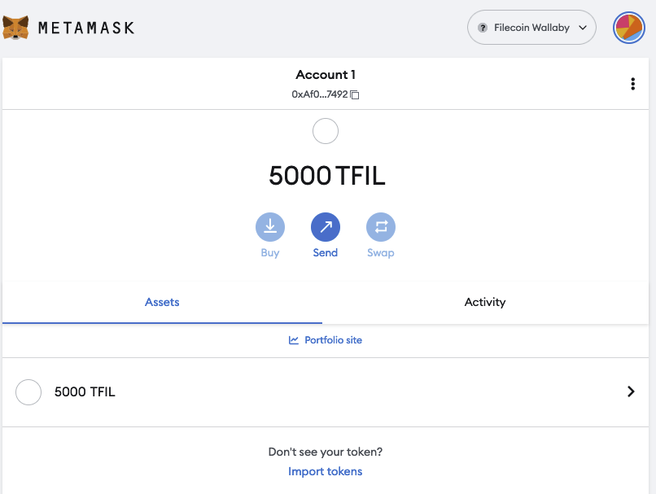

## Deploying your smart contract
The remix IDE is a powerful editor your can use to write your smart contracts. You will be able to write, compile and deploy them directly from it. In order to deploy them on the wallaby network, we will use MetaMask as the current environment. 

From the main menu, go to "Deploy & Run Transactions". It is the latest icon on the left-side menu. 

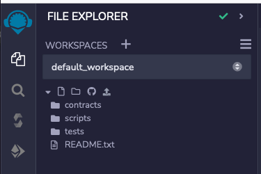

Now you need to choose "Injected provider - MetaMask" as the environment you want to use. 

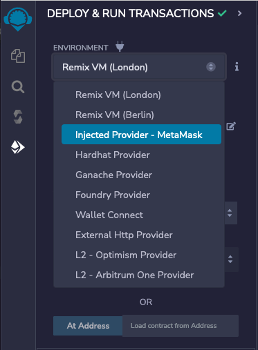

If this is the first time you do it, a popup will appear in the screen. It will request you to accept the new connection from Remix with MetaMask. Just follow the flow, and you will be ready to go. 

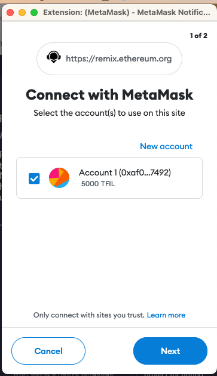 
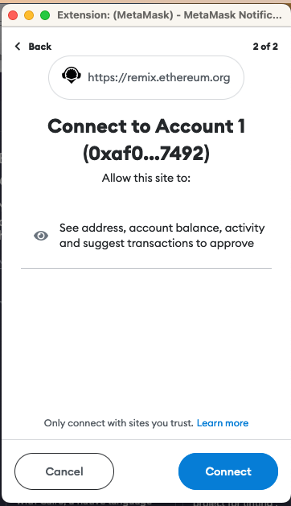
